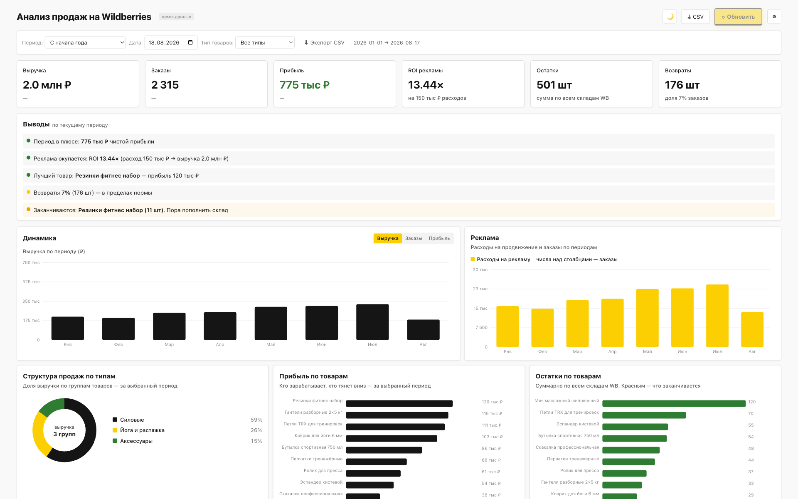
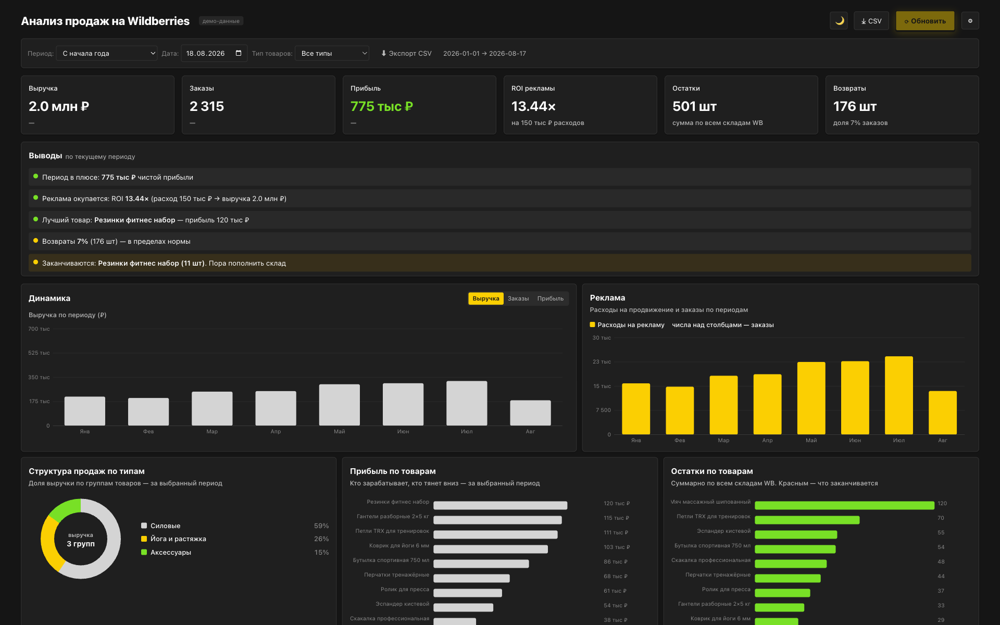

# Dashboard-SPR-MVP

Автономный HTML-дашборд продаж для селлеров Wildberries. Один файл, без облака, без CDN. Открывается двойным кликом.



## Что это

Готовый дашборд для аналитики продаж на Wildberries. Показывает:

- **KPI** — выручка, заказы, средний чек, возвраты, реклама, прибыль
- **Динамика продаж** — график по дням
- **Реклама** — расходы и CTR
- **Прибыль по товарам** — после себестоимости
- **Остатки на складе** — где заканчивается товар
- **Топ товаров** — таблица с фильтрами и сортировкой
- **Темы** — светлая и тёмная

Все данные внутри файла как демо. После запуска дашборд сразу показывает графики и метрики — без настройки.

## Особенности

- **Один HTML-файл** — нет внешних зависимостей, всё inline. Работает офлайн.
- **Адаптивный** — корректно отображается от 400px до 1920px (телефон, планшет, компьютер).
- **SVG-графики** — без библиотек, чистый JS. Пересчитываются при ресайзе окна.
- **Демо-данные** — фиктивные цифры, можно использовать для портфолио.
- **Фильтры рабочие** — на демо-данных все кнопки и фильтры работают.

## Состав репозитория

```
Dashboard-SPR-MVP/
├── index.html              ← сам дашборд
├── README.md               ← этот файл
├── спецификация.md         ← тех. задание и описание метрик
├── КАК-ПОЛЬЗОВАТЬСЯ.md     ← инструкция для конечного пользователя
├── cost-template.csv       ← шаблон CSV для ввода себестоимости
└── скриншоты/
    ├── screen-light-1920.png   ← светлая тема
    └── screen-dark-1920.png    ← тёмная тема
```

## Запуск

Открой `index.html` двойным кликом — дашборд сразу заработает с демо-данными.

Никакого сервера, API или ключей не нужно. Это MVP для согласования интерфейса и логики — все цифры внутри файла как демо.

## Назначение MVP

- **Согласование с заказчиком** — фиктивные данные для демонстрации интерфейса и логики.
- **Учебный проект** — образец действующей MVP-версии дашборда.
- **Шаблон для переноса** — можно переслать другим пользователям, чтобы они прочитали структуру и собрали своё.

Полное ТЗ — в `спецификация.md`. Подробная инструкция для конечного пользователя — в `КАК-ПОЛЬЗОВАТЬСЯ.md`.

## Скриншоты

| Светлая тема | Тёмная тема |
|---|---|
|  |  |

## Технологии

- HTML + CSS + JavaScript (ванильный, без фреймворков)
- SVG для графиков (без Chart.js, D3 и прочего)
- localStorage для пользовательских настроек
- Чистый `fetch` для API-запросов

## Палитра

sproots: `#f9f9f9` / `#151515` / `#fbcf02`, Montserrat, радиус 4px.

## Лицензия

MIT — можно использовать как шаблон для своих проектов.